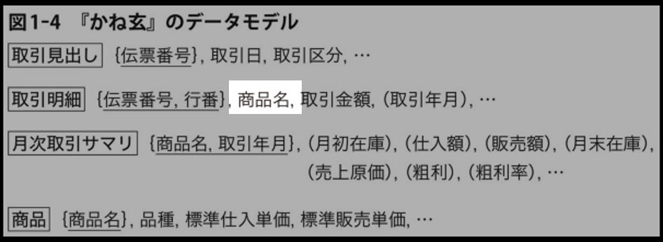
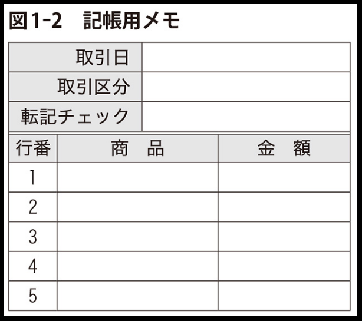

# 1 章「かね玄」のデータモデル

データモデリングの基本を具体例を見ながら体験します。
その後で、データモデリングのお作法を学びます。（覚えます）

## 具体例をもとに、データ管理の発展を見る

あるお店の取引を管理することを考えます。
「データを管理する際に、何が大事で、どんなことに気をつけないといけないのか。」
「もし、そうしなかったら、どんな大変な労力がかかってしまうのか。」
ということを体験します。

### ①［取引簿］

- （目的）取引を記録するために［取引簿］を導入
- （課題）記帳に時間がかかりすぎる

### ②［取引簿］＋［伝票］

- （目的）記録を素早く行うために［伝票］を導入
- （課題）過去の［取引簿］と［伝票］の対応がわからない
  - 転記をミスったときに取り返しつかない

### ③［取引簿］＋［伝票（改）］

- （目的）［取引簿］と［伝票］を紐付けるため、（伝票番号）項目を導入

### ④［取引簿］＋［伝票（改）］＋［月間集計表］

- （目的）商品毎の利益を見るため、［月間集計表］を導入
- （課題）商品名が統一されてないと、同一商品として集計できない
  - ひとつの商品を表す語が複数あると混乱する

### ⑤［取引簿］＋［伝票（改）］＋［月間集計表］＋［商品台帳］

- （目的）商品名を一元管理するため、［商品台帳］を導入
- （課題）［商品台帳］の商品名がダブったときに、修正がめちゃくちゃ大変

## データモデルのお作法（ざっくり説明）

### テーブルとは

- いくつかのデータ項目のまとまりのこと

### フィールドとは

- テーブルに含まれるデータ項目のこと

### 論理フィールドとは

- フィールドのうち、他のフィールドから導出できるもの

### 物理フィールドとは

- フィールドのうち、論理フィールド以外のもの

### ビューとは

- データを人間が見たい形式で出力したもの

  
  
  

### 主キーとは

- テーブルの中で、もっとも重要なフィールドのこと

### 関数従属性とは

- ある値が決まると、他の値も確実に定まるという関係性のこと

### テーブル関連とは

- テーブルの主キー同士の関連性のこと

### 多重度とは

- テーブル関連の中で、片方のレコードに対して、もう片方がどのくらい対応するかのこと
