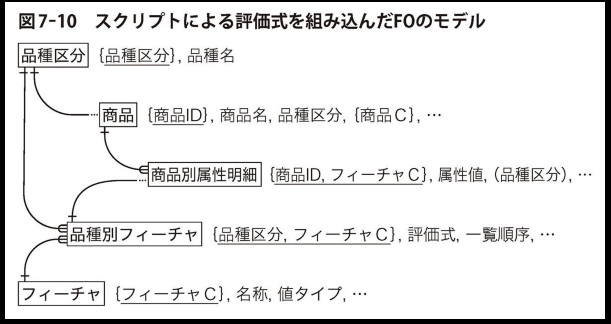

# 4 章データモデルの進め方

## 受注生産

- メーカーは、カスタム品を扱っている

### 標準品

- 仕様が決まっている製品
- 製造→販売→出荷

### カスタム品

- 受注ごとに仕様が異なる製品
- 受注（販売）→仕様定義→製造→出荷

- 標準品の［製造構成明細］や［工程明細］を元に、カスタム品のマスター情報を作成する

### 受注～製造の流れ

1. 受注品用のマスター情報を登録（全体の8割程度カバーできる範囲）
2. 顧客から、カスタム品を受注する
3. 販売品として登録
4. 受注情報を登録
   1. 受注品の仕様明細
   2. 受注品の出荷スケジュール
5. 受注品に対する製造指示
   1. 製造工程の明細
   2. 製造に必要な構成品の明細

### 受注生産のデータモデル比較

  
  

- 受注1件ごとに、［受注］レコード作成
- ［受注］テーブルは、［販売品属性］を参照
  - 1つの販売品に対して、0件～複数件の受注を受け得る
  - ［販売品属性］を参照する項目はどれ？※
- ［受注］ごとに、［出荷］レコードを複数件登録
  - 受注後は、必ず、1日～複数日に分けて出荷するスケジュールを立てる
- ［受注］ごとに、［受注別FO明細］を複数件登録
  - 受注品の仕様は、受注ごとに必ず定義される
  - 受注品の属性（フィーチャー）は、［品目別属性明細］と同様に、［品種別フィーチャー］を参照？※
- ［製造指示］テーブルは、［受注］テーブルを参照
  - 受注に対応した、製造指示が作成される
  - 受注が存在しなくても、製造指示が出される場合もある
- ［製造指示］テーブルは、［製造品属性］テーブルを参照
  - 製造品属性に存在しない製造指示を出すことはできない
- ［製造指示］ごとに、［製造指示工程明細］レコードを複数件登録
  - 製造ごとに、必ず製造工程が発生する
  - ［製造指示工程明細］は、［製造工程明細］と同様に、［工程］を参照
- ［製造指示］ごとに、［製造指示構成品明細］レコードを複数件登録
  - 製造ごとに、必ず製造構成品が必要
  - ［製造指示構成品明細］から［製造指示工程明細］への参照関係がないのは、製造工程ごとの構成品を管理しないということ？※

### 受注生産時の考慮

- 不良品が発生するケース
- 受注発生を見越して、事前に作り置きするケース
- 工場の稼働率の調整
- 作業場の負荷
- 構成品の在庫不足

---

## サービスと契約

### サービス業

- 物理的な実体を伴わない商品を扱う
- 製造業と同様に、FOモデルを適用できる

### サービス体系のモデル、製造業と比較

  
  

- 製造業の場合は、［商品］ごとに［商品別フィーチャー］を作成しなかった
- ［商品］をある程度まとめた概念として［品種区分］を用意して、［品種区分］ごとに［品種別フィーチャー］を用意していた
- 一方で［サービス］は、直接［サービス別フィーチャー］を用意している
- 販売するサービスの特性として、「他サービスと完全に共有できるフィーチャーを持ちづらい」「サービスの数自体がそこまで多くない」などが考えられる？※
- 「OPT値」に応じた「OPT単価」が追加されている
  - 何らかの取引量のレンジで決まる単価を扱う
  - 例）保険サービスにおいて、補償額1億円までなら保険料10万円/月、10億円までなら保険料30万円等？？

### サービス体系と契約のモデル

  
  

- 追加されたテーブルは3つ
  - ［契約見出し］テーブル
  - ［契約明細］テーブル
  - ［月次契約サマリ］テーブル

- ［サービス］を一定期間利用することを契約しつつ
- 個別のオプション明細については、［契約明細］テーブルで各「サービス別FO」に対してどのくらいの「OPT値」となるかを決めている
- ［月次契約サマリ］は、財務管理のためのテーブル？※

### もし、FO体系のモデルではなかったら？

- 取引量の多い顧客用にシステムを個別開発
- 似たようなサービスの乱立

---

## 発注と入荷

  

