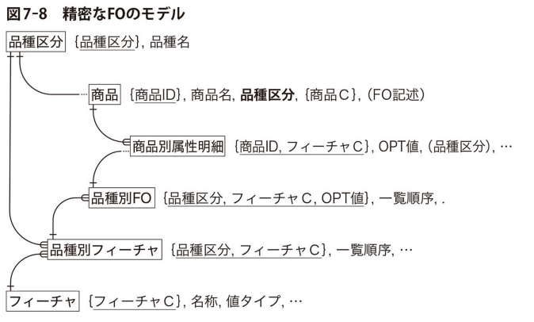

# 7 章商品と契約（後半）

## 受注生産

- メーカーは、カスタム品を扱っている

### 標準品

- 仕様が決まっている製品
- 製造 → 販売 → 出荷

### カスタム品

- 受注ごとに仕様が異なる製品
- 受注（販売）→ 仕様定義 → 製造 → 出荷

- 標準品の［製造構成明細］や［工程明細］を元に、カスタム品のマスター情報を作成する

### 受注～製造の流れ

1. 受注品用のマスター情報を登録（全体の 8 割程度カバーできる範囲）
2. 顧客から、カスタム品を受注する
3. 販売品として登録
4. 受注情報を登録
   1. 受注品の仕様明細
   2. 受注品の出荷スケジュール
5. 受注品に対する製造指示
   1. 製造工程の明細
   2. 製造に必要な構成品の明細

### 受注生産のデータモデル比較

  
  

- 受注 1 件ごとに、［受注］レコード作成
- ［受注］テーブルは、［販売品属性］を参照
  - 1 つの販売品に対して、0 件～複数件の受注を受け得る
  - ［販売品属性］を参照する項目はどれ？※
- ［受注］ごとに、［出荷］レコードを複数件登録
  - 受注後は、必ず、1 日～複数日に分けて出荷するスケジュールを立てる
- ［受注］ごとに、［受注別 FO 明細］を複数件登録
  - 受注品の仕様は、受注ごとに必ず定義される
  - 受注品の属性（フィーチャー）は、［品目別属性明細］と同様に、［品種別フィーチャー］を参照？※
- ［製造指示］テーブルは、［受注］テーブルを参照
  - 受注に対応した、製造指示が作成される
  - 受注が存在しなくても、製造指示が出される場合もある？
- ［製造指示］テーブルは、［製造品属性］テーブルを参照
  - 製造品属性に存在しない製造指示を出すこともある？
- ［製造指示］ごとに、［製造指示工程明細］レコードを複数件登録
  - 製造ごとに、必ず製造工程が発生する
  - 基本的には［製造工程明細］をコピーして作成するが、カスタム品として仕様が異なる箇所は独自に定義する？
- ［製造指示］ごとに、［製造指示構成品明細］レコードを複数件登録
  - 製造ごとに、必ず製造構成品が必要
  - 基本的には［製造構成品明細］をコピーして作成するが、カスタム品として仕様が異なる箇所は独自に定義する？
  - ［製造指示構成品明細］から［製造指示工程明細］への参照関係がないのは、製造工程ごとの構成品を管理しないということ？

### 受注生産時の考慮（※教科書参照）

- 不良品が発生するケース
- 受注発生を見越して、事前に作り置きするケース
- 工場の稼働率の調整
- 作業場の負荷
- 構成品の在庫不足

---

## サービスと契約

### サービス業

- 物理的な実体を伴わない商品を扱う
  - 金融サービス
  - デジタルサービス
- 製造業と異なり単品を納入して取引終了する形態ではなく、一定の期間を伴う継続的なサービス提供に対する対価を支払うという契約
- 製造業と同様に、FO モデルを適用できる

### サービス体系のモデル、製造業と比較

- 一定期間のサービス提供に対して、料金が決まる
- ひとつのサービスには、複数のオプションがある
- サービス提供の基本料金と、オプションの料金の合算が、実際の請求額となる
- オプションはそれぞれのレンジによって料金が定まる
  - 例）保険サービス：補償額 1 億円までなら保険料 10 万円/月、10 億円までなら保険料 30 万円等

  
  

- 製造業の場合は［商品］をある程度まとめた概念として［品種区分］を用意し、［品種区分］ごとに［品種別フィーチャー］を用意していた
- 一方でサービス業では、［サービス］から直接［サービス別フィーチャー］をつないでいる
  - 販売するサービスの特性として「他サービスと完全に共有できるフィーチャーを持ちづらい」「サービスの数自体がそこまで多くない」などが考えられる？※
- 「OPT 値」に応じた「OPT 単価」が追加されている
  - 何らかの取引量のレンジで決まる単価を扱う
- _［サービス基本料金］テーブルの意義がよくわからない..._

### サービス体系と契約のモデル

  
  

- 追加されたテーブルは 3 つ

  - ［契約見出し］テーブル
  - ［契約明細］テーブル
  - ［月次契約サマリ］テーブル

- ［サービス］を一定期間利用することを契約しつつ
- 個別のオプション明細については、［契約明細］テーブルで各「サービス別 FO」に対してどのくらいの「OPT 値」となるかを決めている
- ［月次契約サマリ］は、財務管理のためのテーブル？※
- ［フィーチャ］テーブルは省略

### もし、FO 体系のモデルではなかったら？（※教科書参照）

- 取引量の多い顧客用にシステムを個別開発
  - 専用のテーブルを設けることになる？
- 似たようなサービスが乱立してしまう

---

## 発注と入荷

- 物販業向けの一般的な発注・入荷に関するモデル

**業務**

- 物販用に、商品の仕入を行う
- 仕入のため、仕入先に発注を行う
- 発注した商品は、仕入先から納品（入荷）される

### プロセス指向的な（いまいちな）モデリング

  

- 発注業務に関連して［発注見出し］テーブルと［発注明細］テーブルを用意
- ［発注見出し］テーブルは、［仕入先］テーブルを参照
- ［発注明細］テーブルは、［品目］テーブルを参照

- 入荷業務に関連して［入荷見出し］テーブルと［入荷明細］テーブルを用意
- ［入荷見出し］テーブルは、［仕入先］テーブルを参照
- ［入荷明細］テーブルは、［品目］テーブルを参照

**いまいちな点**

- ［発注業務］と［入荷業務］を個別に考える
  - 発注と入荷の関連性がモデル上で見えない
- 業務を扱う人が別？※
- _表現は過激だけど、スケールを大きくすれば、あり得るケースだと思う_
  - _縦割り組織だと、余計にこうなりそう_

#### 業務フローとデータ更新

1. 発注業務
   1. 仕入先に、単価と数、納期を指定して、商品の発注を行う
      - 発注するタイミングで［発注見出し］および［発注明細］テーブルを新規登録する
      - ［発注明細］の｢発注残数｣は手計算する
2. 入荷業務
   1. 仕入れ先から、商品を受け取る
      - 入荷するタイミングで［入荷見出し］および［入荷明細］テーブルを新規登録する
      - ［入荷明細］の「入荷単価」「入荷数」は入荷状況に応じて手入力する

#### このモデルの問題点

- ［発注明細］の「発注残数」は、「発注数から入荷数を差し引いた値」であることが明示されていない
- 異なる発注に基づいて同一品目の数量がまとめて入荷されたときの動きも見えない
- 似たような親子関係が何度も現れる「親子頻出」アンチパターン

### 抜本的なモデリング

- 発注・入荷データが本来取るべき形や、在庫システムとの連携が強く意識される
- 発注と入荷が関連づけられている

  
  

#### モデルの比較

- ［発注見出し］［入荷見出し］［仕入先］テーブルは変わらない
- ［入荷明細］を［発注明細］テーブルの子テーブルに設定
  - 主キーを「入荷 No」から「発注 No.、発注行番」に変更、「入荷 No.」は参照キーに
- ［入荷明細］テーブルから「入荷単価」を削除
- ［入荷明細］テーブルの「入荷数」を削除して、「入荷予定数」「入荷予定日」「検収数」を追加
- ［発注明細］テーブルから、「発注残数」を削除
- ［発注明細］テーブルに、「確認日」を追加
- ［入荷明細］テーブルの「品目 ID」は削除していない※
  - 代替品を納品されるケースを想定している
  - 発注品目と納入品目が異なる可能性
  - 発注品目が必ず納品されるならば、この項目は不要

#### 業務フローとデータ更新 2

1. 発注業務
   1. 仕入先に、単価と数、希望納期を指定して、商品の発注を行う
      - 発注するタイミングで［発注見出し］および［発注明細］テーブル、［入荷明細］を新規登録する
      - 確認日、入荷 No. はブランク（▲）で登録
   2. 仕入先から、納期回答を受け取る
      - ［入荷明細］テーブルの入荷予定日、予定数を更新する
      - ［発注明細］テーブルの確認日を更新する
2. 入荷業務
   1. 仕入れ先から、商品を受け取る
      - 入荷するタイミングで［入荷見出し］を新規登録する
   2. 入荷内容の検収を行う
      - 内容に応じて［入荷明細］を更新する

  
  
  

### 発注単価の決まり方

- 発注単価を事前に契約するケース
  - これまでの書籍内のケースでは、発注時に都度決定していた

  

- 仕入契約には、期間（発行日、失効日）を設ける
- 仕入品目の発注数に応じて、単価を定める

  - 100 個単位で購入 ⇒ 単価 2000 円、1000 個単位で購入 ⇒ 単価 1500 円

- _モデルとして事前に単価を決めるケースでは、［発注明細］から［仕入契約明細］を参照すると思われる？_
- _参照時に「契約行番」はどのように特定するのか？_

---

## 受注と出荷

- 商品の発注を受けて、出荷を行う側のデータモデル
- 基本的に「発注・入荷」の場合と対称的なモデルとなる

  
  

- ［出荷先］に関する情報を管理する必要がある
  - 仕入時は「場所（どこから来たか）」に関する情報を気にする必要はなかった
  - 出荷時は「場所（どこへ出荷するか）」に関する情報が重要
  - ひとつの会社（取引先）でも、出荷対象となる倉庫は複数存在し得る
- ［得意先］テーブルの子テーブルとして［出荷先］テーブルを追加
- ［出荷先］テーブルでは出荷先名、所在地を管理

- 出荷スケジュールに関する情報を細かく管理する必要がある
  - 仕入時は、納品スケジュールは相手方から通達される情報をそのまま管理するだけでよかった
  - 出荷時は、商品の在庫状況に応じて「いつ、なにを、どのくらい出荷できるか」を細かく管理して相手方に伝える必要がある
- ［出荷明細］テーブルに「出荷更新日」を追加

#### 業務フローとデータ更新 3

1. 受注業務
   1. 得意先から商品の受注を行う
      - 受注したタイミングで、受注数と納期に応じて［受注見出し］および［受注明細］テーブル、［出荷明細］を新規登録する
   2. 受注内容（受注数、納期）が可能であれば、受注時の希望納期をそのまま回答する
      - ［出荷明細］テーブルの出荷予定日、出荷更新日を更新する
      - ［受注明細］テーブルの最終回答日を更新する
   3. 受注内容（受注数、納期）が不可能であれば、こちらの希望納期を回答する
      - ［出荷明細］テーブルの出荷予定日、出荷更新日を更新する
      - ［受注明細］テーブルの最終回答日を更新する
2. 出荷業務
   1. 出荷指示を出す
      - 出荷するタイミングで［出荷見出し］を新規登録する
      - ［出荷明細］の「出荷 No.」を更新する

- 出荷スケジュールが遅延した場合はどうするのか？
- たとえば、商品 A を 12/1 に 1000 個納入すると回答したけど、原材料の仕入が遅延したため、12/1 には 500 個、12/5 に残り 500 個を納入するとなった場合など
  - 新たに［出荷明細］レコードを追加？

#### 業務システムの性能

- 「納期回答リードタイム」の平均値や順守率を計算することで性能を評価できる
  - 受注してから得意先に納期回答するまでの時間
